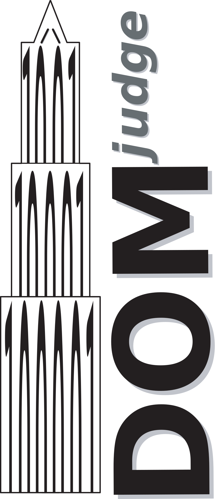

DOMjudge with Hackathon Extensions
----------------------------------

> **Note**: This is a fork of [DOMjudge version 9](https://github.com/DOMjudge/domjudge) with custom hackathon extensions.
> 
> **Original Project**: [DOMjudge](https://www.domjudge.org/) - Programming Contest Jury System  
> **Fork Purpose**: Extended functionality for hackathon-style competitions  
> **Base Version**: DOMjudge 9.x

### Hackathon Extensions Added:
- **Hackathon Toggle**: Enable/disable hackathon mode per contest
- **Enhanced Team Interface**: Modern card-based problem display
- **Deliverable Uploads**: Support for ZIP files, documents, and demo links
- **Manual Rubric Scoring**: Multi-criteria judging system for hackathons
- **Contest Display Data**: Custom banners, descriptions, and metadata
- **Problem Display Enhancement**: Rich descriptions with attachments
- **API Extensions**: Endpoints for hackathon submission management and scoring

---

DOMjudge
--------

This is the Programming Contest Jury System "DOMjudge" version 10.0.0DEV

DOMjudge is a system for running a programming contest, like the
ICPC regional and world championship programming contests.

Installation
------------
We provide [stable releases](https://www.domjudge.org/download) and [daily snapshots](https://www.domjudge.org/snapshot/) of the latest code. Bootstrapping from git is an advanced use case and mostly needed for development. Installing DOMjudge is almost never done via a `git clone`, except for development use cases or testing the latest code. 

Documentation
-------------

For more information on installation and requirements see the
documentation under the doc/manual directory. There is an HTML
version of the documentation available, prebuilt from reStructuredText
sources.

There's also team documentation available, prebuilt in PDF format from
reStructuredText sources, but it contains default/example settings.
To include the correct settings for your local environment, DOMjudge
has to be properly configured first, as parts of the configuration are
used in it (e.g. the URL to the team interface of DOMjudge). For more
information, see the documentation.

All documentation is also available online at the DOMjudge homepage:
	https://www.domjudge.org/documentation
Please note that this documentation is from the latest stable
release and thus might not apply to your version.

A fresh copy of the repository source tree must first be bootstrapped,
generating the configure script and documentation. This can be done
by running 'make dist', see the online documentation, section
"Developer information" for more details.

There is a wiki which collects other pieces of information about
specific configurations or integrations:
https://github.com/DOMjudge/domjudge/wiki

Copyright & Licensing
---------------------

**Original DOMjudge:**  
DOMjudge is Copyright (c) 2004 - 2025 by the DOMjudge developers and
all respective contributors. The current DOMjudge developers are Jaap
Eldering, Nicky Gerritsen, Keith Johnson, Thijs Kinkhorst, Mart
Pluijmaekers, Michael Vasseur and Tobias Werth; see the manual for
a complete list of contributors.

**Hackathon Extensions:**  
The hackathon extensions in this fork are additional modifications built on top of the original DOMjudge codebase. This fork maintains compatibility with the original DOMjudge GPL license while adding new functionality specifically designed for hackathon competitions.

DOMjudge, including its documentation, is free software; you can
redistribute it and/or modify it under the terms of the GNU General
Public License as published by the Free Software Foundation; either
version 2, or (at your option) any later version. See the file
COPYING.

Additionally, parts of this system are based on other programs, which
are covered by other copyrights. This will be noted in the files
themselves and these copyrights/attributions can also be found in the
DOMjudge manual.

The following JavaScript libraries/snippets are included:
- coloris: Momo Bassit, licensed under the MIT license, see COPYING.MIT.
- Monaco editor: licensed under the MIT license, see COPYING.MIT.

The default validator from the Kattis problemtools package is
included, licensed under the MIT licence, see COPYING.MIT.

The M4 autoconf macros are licensed under all-permissive and GPL3+
licences; see the respective files under m4/ for details.

The DOMjudge tarball ships external library dependencies in the
webapp/vendor directory. These are covered by their individual licenses
as specified in the file composer.lock.

Contact
-------

The DOMjudge homepage can be found at:
https://www.domjudge.org/

Announcements of new releases are sent to our low volume announcements
mailinglist. Subscription to this list is done via
https://www.domjudge.org/mailman/postorius/lists/domjudge-announce.domjudge.org/

The developers can be reached through the mailinglist
domjudge-devel@domjudge.org. You need to be subscribed before
you can post. Information, subscription and archives are available at:
https://www.domjudge.org/mailman/postorius/lists/domjudge-devel.domjudge.org/

DOMjudge has a Slack workspace where a number of developers and
users of DOMjudge linger. More information can be found at
https://www.domjudge.org/chat

Special thanks
--------------

[Jetbrains](https://www.jetbrains.com) for providing a free license for their
  IDEs.

[Blackfire](https://blackfire.io) for providing a free license for their
  profiling tool.

